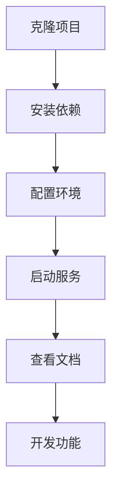

# FastAPI 服务端模版项目 - 产品需求文档

## 1. 产品概览

这是一个最简单的 FastAPI 服务端模版项目，为开发者提供快速启动 FastAPI 应用的基础框架。
项目旨在解决开发者从零开始搭建 FastAPI 项目的复杂性，提供标准化的项目结构和最佳实践配置。
目标是成为 Python Web API 开发的标准起点，帮助开发者快速构建高质量的 RESTful API 服务。

## 2. 核心功能

### 2.1 用户角色

| 角色  | 使用方式    | 核心权限                     |
| --- | ------- | ------------------------ |
| 开发者 | 克隆或下载模版 | 可以使用所有模版功能，修改和扩展代码       |
| 学习者 | 参考学习    | 可以查看代码结构，学习 FastAPI 最佳实践 |

### 2.2 功能模块

我们的 FastAPI 模版包含以下核心页面和功能：

1. **API 服务**: 基础的 FastAPI 应用入口，健康检查端点
2. **示例接口**: 用户管理相关的 CRUD 操作示例
3. **项目配置**: 依赖管理和环境配置文件
4. **开发工具**: 开发环境启动和调试配置

### 2.3 功能详情

| 模块名称   | 功能名称   | 功能描述                                       |
| ------ | ------ | ------------------------------------------ |
| API 服务 | 应用入口   | 创建 FastAPI 应用实例，配置基础中间件和路由                 |
| API 服务 | 健康检查   | 提供 /health 端点，返回服务状态信息                     |
| 示例接口   | 用户列表   | GET /users - 获取用户列表，支持分页                   |
| 示例接口   | 用户详情   | GET /users/{id} - 根据 ID 获取单个用户信息           |
| 示例接口   | 创建用户   | POST /users - 创建新用户，包含数据验证                 |
| 示例接口   | 更新用户   | PUT /users/{id} - 更新指定用户信息                 |
| 示例接口   | 删除用户   | DELETE /users/{id} - 删除指定用户                |
| 项目配置   | 依赖管理   | requirements.txt 和 pyproject.toml 文件管理项目依赖 |
| 项目配置   | 环境配置   | .env 文件模版和配置加载机制                           |
| 开发工具   | 启动脚本   | 提供开发环境快速启动命令                               |
| 开发工具   | API 文档 | 自动生成的 Swagger UI 和 ReDoc 文档                |

## 3. 核心流程

**开发者使用流程：**

1. 克隆或下载模版项目
2. 安装项目依赖 (pip install -r requirements.txt)
3. 配置环境变量 (复制 .env.example 到 .env)
4. 启动开发服务器 (uvicorn main:app --reload)
5. 访问 API 文档 (<http://localhost:8000/docs>)
6. 基于模版开发自己的 API 功能

## 4. 用户界面设计

### 4.1 设计风格

* **主色调**: 蓝色系 (#1f2937, #3b82f6) - 专业、可信赖

* **辅助色**: 绿色 (#10b981) 用于成功状态，红色 (#ef4444) 用于错误状态

* **字体**: 系统默认字体，代码使用等宽字体

* **布局风格**: 简洁的 REST API 文档风格，基于 FastAPI 自动生成的 Swagger UI

* **图标风格**: 使用 Swagger UI 默认图标集

### 4.2 界面设计概览

| 页面名称     | 模块名称       | UI 元素                       |
| -------- | ---------- | --------------------------- |
| API 文档首页 | Swagger UI | 深蓝色头部，白色背景，清晰的端点分组和展示       |
| 端点详情     | 接口文档       | 展开式设计，包含请求参数、响应示例、状态码说明     |
| 模型定义     | 数据模型       | 结构化的 JSON Schema 展示，支持折叠和展开 |

### 4.3 响应式设计

项目主要面向开发者使用，优先支持桌面端浏览器访问 API 文档，同时确保移动端基本可用性。
