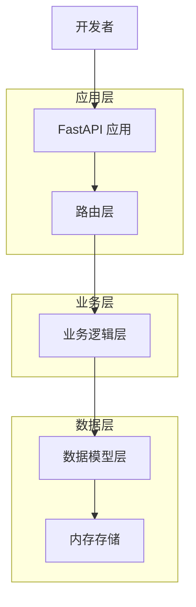
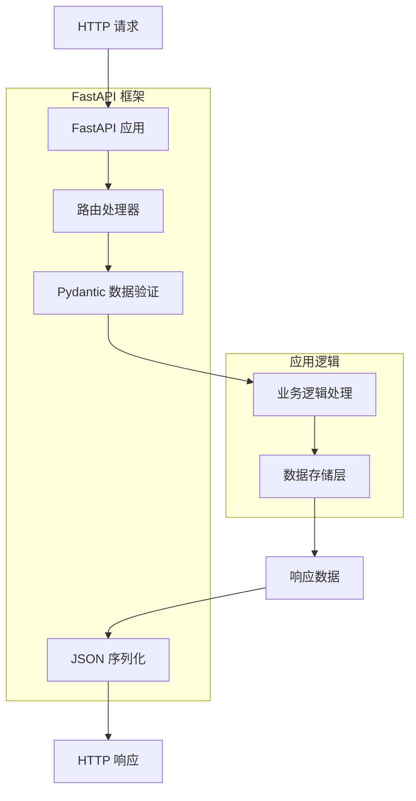
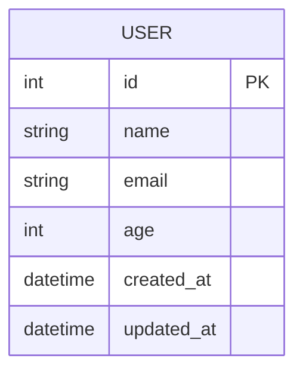

# FastAPI 服务端模版项目 - 技术架构文档

## 1. 架构设计



## 2. 技术描述

* Frontend: 无 (纯后端 API 服务)

* Backend: FastAPI\@0.104.1 + Uvicorn\@0.24.0 + Pydantic\@2.5.0

* Database: 内存存储 (示例用途，可扩展为 PostgreSQL/MySQL)

* 开发工具: Python\@3.8+

## 3. 路由定义

| 路由      | 用途                      |
| ------- | ----------------------- |
| /       | 根路径，返回欢迎信息              |
| /health | 健康检查端点，返回服务状态           |
| /users  | 用户管理相关的 CRUD 操作         |
| /docs   | Swagger UI 自动生成的 API 文档 |
| /redoc  | ReDoc 格式的 API 文档        |

## 4. API 定义

### 4.1 核心 API

**健康检查**

```
GET /health
```

Response:

| 参数名称      | 参数类型   | 描述    |
| --------- | ------ | ----- |
| status    | string | 服务状态  |
| timestamp | string | 当前时间戳 |

示例响应:

```json
{
  "status": "healthy",
  "timestamp": "2024-01-15T10:30:00Z"
}
```

**获取用户列表**

```
GET /users
```

Query Parameters:

| 参数名称  | 参数类型    | 是否必需  | 描述           |
| ----- | ------- | ----- | ------------ |
| skip  | integer | false | 跳过的记录数，默认 0  |
| limit | integer | false | 返回的记录数，默认 10 |

Response:

| 参数名称  | 参数类型    | 描述   |
| ----- | ------- | ---- |
| users | array   | 用户列表 |
| total | integer | 总用户数 |

**创建用户**

```
POST /users
```

Request Body:

| 参数名称  | 参数类型    | 是否必需  | 描述   |
| ----- | ------- | ----- | ---- |
| name  | string  | true  | 用户姓名 |
| email | string  | true  | 用户邮箱 |
| age   | integer | false | 用户年龄 |

Response:

| 参数名称        | 参数类型    | 描述    |
| ----------- | ------- | ----- |
| id          | integer | 用户 ID |
| name        | string  | 用户姓名  |
| email       | string  | 用户邮箱  |
| age         | integer | 用户年龄  |
| created\_at | string  | 创建时间  |

示例请求:

```json
{
  "name": "张三",
  "email": "zhangsan@example.com",
  "age": 25
}
```

**获取单个用户**

```
GET /users/{user_id}
```

Path Parameters:

| 参数名称     | 参数类型    | 是否必需 | 描述    |
| -------- | ------- | ---- | ----- |
| user\_id | integer | true | 用户 ID |

**更新用户**

```
PUT /users/{user_id}
```

Path Parameters:

| 参数名称     | 参数类型    | 是否必需 | 描述    |
| -------- | ------- | ---- | ----- |
| user\_id | integer | true | 用户 ID |

Request Body: 同创建用户

**删除用户**

```
DELETE /users/{user_id}
```

Path Parameters:

| 参数名称     | 参数类型    | 是否必需 | 描述    |
| -------- | ------- | ---- | ----- |
| user\_id | integer | true | 用户 ID |

Response:

| 参数名称    | 参数类型   | 描述     |
| ------- | ------ | ------ |
| message | string | 删除结果消息 |

## 5. 服务架构图



## 6. 数据模型

### 6.1 数据模型定义



### 6.2 数据定义语言

**用户模型 (User)**

```python
# Pydantic 模型定义
from pydantic import BaseModel, EmailStr
from datetime import datetime
from typing import Optional

class UserBase(BaseModel):
    name: str
    email: EmailStr
    age: Optional[int] = None

class UserCreate(UserBase):
    pass

class UserUpdate(UserBase):
    name: Optional[str] = None
    email: Optional[EmailStr] = None

class User(UserBase):
    id: int
    created_at: datetime
    updated_at: datetime
    
    class Config:
        from_attributes = True
```

**响应模型**

```python
class HealthResponse(BaseModel):
    status: str
    timestamp: str

class UserListResponse(BaseModel):
    users: List[User]
    total: int

class MessageResponse(BaseModel):
    message: str
```

**初始化数据**

```python
# 内存存储的示例数据
users_db = [
    {
        "id": 1,
        "name": "张三",
        "email": "zhangsan@example.com",
        "age": 25,
        "created_at": "2024-01-01T00:00:00Z",
        "updated_at": "2024-01-01T00:00:00Z"
    },
    {
        "id": 2,
        "name": "李四",
        "email": "lisi@example.com",
        "age": 30,
        "created_at": "2024-01-02T00:00:00Z",
        "updated_at": "2024-01-02T00:00:00Z"
    }
]
```

